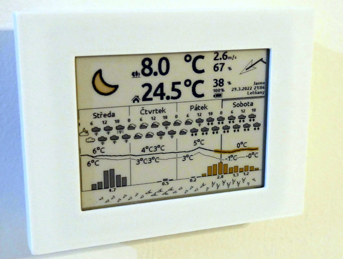

# Meteoink


## What Meteoink is

Meteoink is home meteostation based on several variants of E-Ink displays such as
[5.65inch 7-color (F) E-Ink display](https://www.waveshare.com/wiki/5.65inch_e-Paper_Module_(F)_Manual) (variant `acep`),
[4.2 inch dual color E-Ink display](https://www.waveshare.com/4.2inch-e-paper-module-c.htm) (variant `bwy`) or
[T5-4.7 Inch E-paper](https://www.lilygo.cc/products/t5-4-7-inch-e-paper) (variant `epd47`). Platform running this meteostation is [micropython 1.20](https://micropython.org/) runningt on [TTGO-T8-ESP32](https://github.com/LilyGO/TTGO-T8-ESP32/tree/master)
compatible board.

Meteostation is connected to your home WiFi and uses data from [OpenWeatherMap](https://openweathermap.org/).
It also uses [DHT22](https://github.com/semestrinis/Arduino/wiki/DHT22-temperature-humidity-sensor)
sensor for measuring indoor temperature and humidity. Whole system is powered from one
[18650 Li-On battery](https://en.wikipedia.org/wiki/List_of_battery_sizes#Lithium-ion_batteries_(rechargeable))
charged through the USB on ESP board. Meteostation is usually operating half a year when refresh time is set to
20 minutes and there is good WiFi access to internet (depends on used battery capacity - also note that showing
the radar data on `acep` variant shorten this time 3-times).


## Wiring


Some pins can be moved to another position by changing config file [pins.py](https://github.com/ondiiik/meteoink/blob/master/esp32/micropython/acep/setup/pins.py).

but keep in mind that not all pins are available for any operation (some are not capable of ADC, some are not capable of SPI, ...).
Also battery is not displayed in wiring as it has its own connector so its connection is obvious.

Just note that variant `epd47` ([T5-4.7 Inch E-paper](https://www.lilygo.cc/products/t5-4-7-inch-e-paper))
does not need to be wired as all i present on board.


## Box

Files for 3D printed parts are stored [here](https://github.com/ondiiik/meteoink/tree/master/box).

Both variants of box are partialy screwed and partially glued as well as electronics. To stitch processor board or battery
you can use acrylate 3M double side tape. DHT22 sensor is glued to chassis (grid for air access shall be on the side pointing
outside the box). When you glue it, apply glue very carefully as it shall not pass inside electronics
(especially in the case of buttons or DHT sensor). When all electronics is inside, then chassis shall be either glued to frame
(BWY variant) or screwed together (ACEP variant).

### BWY (EPD 4.2)


### ACEP (EPD 5.65)


### EPD47 (EPD 4.7)

Just note thatthere is many of possible frames e.g. on [Thingiverse](https://www.thingiverse.com/search?q=T5-4.7&page=1&type=things&sort=relevant) for this model of display.

## Micropython

To make software running on ESP32, you have to install Micropython first on it. You shall use
[custom built of Micropython](https://github.com/ondiiik/meteoink/blob/master/esp32/micropython.bin) which contains
all necessary, including required python code. This also allow meteostation to startup way faster, what significantly
reduce battery consumption.

### Flashing of micropython

All necessary files and upload script can be found in repository folder [esp32](https://github.com/ondiiik/meteoink/tree/master/esp32).
Basically this 3 files are required:

- [micropython.bin](https://github.com/ondiiik/meteoink/raw/master/esp32/micropython.bin)
- [bootloader.bin](https://github.com/ondiiik/meteoink/raw/master/esp32/bootloader.bin)
- [partition-table.bin](https://github.com/ondiiik/meteoink/raw/master/esp32/partition-table.bin)

To flash firmware to your ESP32 board you can use [flash.sh](https://github.com/ondiiik/meteoink/raw/master/esp32/flash.sh)
shell script. Just note that you will need to have installed [python interpreter](https://www.python.org/downloads/) first. 
You also need to have [esptool](https://pypi.org/project/esptool/) installed in your `python`. Once you have `python` installed
on your PC you can install `esptool` by following command:

```
pip install esptool
```

Then you can run [flash.sh](https://github.com/ondiiik/meteoink/raw/master/esp32/flash.sh) script to flash firmware into your
ESP32 board. You can use first argument to specify custom USB UART port where board is connected (otherwise `/dev/ttyUSB0`
is used by default). Just note that this script will erase flash on ESP32 including file system, so you can be sure that
your previous data will be definitely lost (good idea to backup them before flashing). 


## Upload binary files

Each meteostation variant needs to upload also files with web content and binaries with graphics. This binaries are located in repository folder [esp32/micropython](https://github.com/ondiiik/meteoink/tree/master/esp32/micropython) for each variant of
display. There shall be also uploaded file `hw.json` into `cfg` describing in which mode and with which pins the meteostation
will work.

Once you have installed `python` on your PC you can use [ampy](https://techtutorialsx.com/2017/06/04/esp32-esp8266-micropython-uploading-files-to-the-file-system/) or
[Thonny IDE](https://randomnerdtutorials.com/getting-started-thonny-micropython-python-ide-esp32-esp8266/) to do this job for you.
Following files needs to be copied according to variant you use:

#### Files for variant ACEP


  - all files from folder [esp32/micropython/acep](https://github.com/ondiiik/meteoink/tree/master/esp32/micropython/acep).
  - following `JSON` file into `cfg/hw.json` (this is also created automatically by default when this file is missing).

```
{
    "variant": "acep",
    "pins": {
        "sck": 13,
        "mosi": 14,
        "miso": 12,
        "cs": 15,
        "dc": 27,
        "rst": 26,
        "busy": 25,
        "dht": 22,
        "led": 21,
        "vbat": 35,
        "buzzer": 33
    },
    "buttons": {
        "hotspot": 32,
        "alert": -1,
        "sleep": -1
    }
}
```

#### Files for variant BWY



  - all files from folder [esp32/micropython/acep](https://github.com/ondiiik/meteoink/tree/master/esp32/micropython/bwy).
  - following `JSON` file into `cfg/hw.json`.

```
{
    "variant": "bwy",
    "pins": {
        "sck": 13,
        "mosi": 14,
        "miso": 12,
        "cs": 15,
        "dc": 27,
        "rst": 26,
        "busy": 25,
        "dht": 22,
        "led": 21,
        "vbat": 35,
        "buzzer": 33
    },
    "buttons": {
        "hotspot": 32,
        "alert": -1,
        "sleep": -1
    }
}
```

#### Files for variant EPD47


  - all files from folder [esp32/micropython/acep](https://github.com/ondiiik/meteoink/tree/master/esp32/micropython/gs).
  - following `JSON` file into `cfg/hw.json`.

```
{
    "variant": "lilygo_epd47",
    "pins": {
        "sck": 13,
        "mosi": 14,
        "miso": 12,
        "cs": 15,
        "dc": 27,
        "rst": 26,
        "busy": 25,
        "dht": 22,
        "led": 21,
        "vbat": 35,
        "buzzer": 33
    },
    "buttons": {
        "hotspot": 32,
        "alert": -1,
        "sleep": -1
    }
}
```

Just note that whenvariant `"lilygo_epd47"` is detected in config file after startup, firmware automatically set-up all pins
for you and switch variant to `"epd47"`.


## Initial configuration

When all files are uploaded and meteostation restarted, it creates all missing `JSON` files in folder `cfg`. However
this initial data are missing some important data (API key, WiFi setup, location, ...). This causes that metostation
automatically switch to WiFi AP mode. You can use QR codes displayed on screen to setup your mobile phone WiFi to attach
to meteostation AP and open suitable WEB page.


Once you are connected to meteostation, you shall see webpage similar to this one:


To make station into operation you have to do following steps:

### Add your location

You shall add at least one location at the beginning. This location will be later used in WiFi configuration.
You can use more locations and bind them later to various WiFi, so when you are taking your weather station on holiday,
it choose location according to WiFi in your location.

### Add WiFi

Next step is to connect WiFi. When you attempt to connect WiFi, the list of available networks will be displayed.
Then you can choose one you want to use, assign suitable location and store it.

### Set OpenWeatherMap API key

The API key is long hash number which you shall
[get from OpenWeatherMap](https://home.openweathermap.org/users/sign_up). There are some personal API keys which are
for free however registration is required.


## Meteostation

Here we go ... once all above is passed, then simply press reset and wait till station is connected and forecast
displayed (it may take about one minute)


## Reconfiguration

If you want to get into setup WEB page again, then you have restart meteostation when holding **config**
button, till beep (it may take a few seconds) and meteostation became to start to hotspot mode again.
Then QR codes appears on screen and configuration web server will be ready after next beep.

Just note that this is **bit more complicated with EPD47 variant** which needs to do one more reboot after
display is repainted (rebooting will happen automatically). In this case you have to hold **config** button
whole time till you hear short ascending melody signalizes that WEB server is running.


## Manual configuration

All items configured by WEB interface are at the end stored in [JSON](https://cs.wikipedia.org/wiki/JavaScript_Object_Notation) files
in `cfg` folder on device. If this files are missing, they are created automatically after first start of meteostation. This files
can be also edited manually (e.g. using [Thonny IDE](https://randomnerdtutorials.com/getting-started-thonny-micropython-python-ide-esp32-esp8266/)),
and they are then used after restart. However be careful when editing them, especially files `connection.json`
and `location.json`, where `connection.json` which uses index to `location.json` as reference and is easy to break binding between them.

Items in some of this files are described here:

### hw.json

```
{
    "variant": "acep",
    "pins": {
        "sck": 13,
        "mosi": 14,
        "miso": 12,
        "cs": 15,
        "dc": 27,
        "rst": 26,
        "busy": 25,
        "dht": 22,
        "led": 21,
        "vbat": 35,
        "buzzer": 33
    },
    "buttons": {
        "hotspot": 32,
        "alert": -1,
        "sleep": -1
    }
}
```

- `"variant"` - Variant of used board. Can be one of `"acep"`, `"bwy"` or `"epd47"`
  (or `"lilygo_epd47"` which forces auto-setup of pins after reboot).
- `"pins"` - Configurations of pins used for communication with peripheries.
- `"buttons"` - Configurations of pins used for connecting of control buttons.


### api.json

```
{
    "apikey": "",
    "units": "metric",
    "language": "en",
    "variant": 4
}
```

- `"apikey"` - `apikey` obtained from [OpenWeatherMap](https://home.openweathermap.org/users/sign_up) used to download forecast.
- `"units"` - Which units shall be used (`"metric"` or `"imperial"`).
- `"language"` - Which language shall be used  (`"cz"` or `"en"`).
- `"variant"` - How much days shall be displayed in forecast (number in range from 2 to 5, where 2 uses more detailed variant of forecast).


### beep.json

```
{
    "temp_balanced": false,
    "error_beep": false
}
```

- `"temp_balanced"` - Boolean telling if outdoor and indoor temperatures are balanced (so you can open window and start cooling your house).
- `"error_beep"` - Boolean telling if station shell you notify by beeping when some software error occur (goot for long time testing).


### sys.json

```
{
    "exception_dump": 0,
    "log_level": "info",
    "led_enabled": false,
}
```

- `"exception_dump"` - Says how much bytes can be stored as exceptions dump into file system. Use 0 to disable this dumps.
- `"log_level"` - Verbosity of logging on UART terminal. Use one of `"debug"`, `"info"`, `"warning"`, `"error"` or `"critical"`.
- `"led_enabled"` - Tells if LED diode shall be used to report state of station (disable to safe a bit of battery juice).


## Others

### Translations

Currently supported languages are English and Czech, however any support for translation to another language is welcommed.
If someone wants to add the new language, it can be done in folder [lang](https://github.com/ondiiik/meteoink/tree/master/simulator/lang).
Translation is always a dictionary where the key is English sentence and the value is its translation.

If some additional characters needs to be added, this shall be done in file [font2png.py](https://github.com/ondiiik/meteoink/blob/master/graphics/font2png.py).
There is a line just like following containing supported characters:

`chars = 'aábcčdďeéěfghiíjklmnňoópqrřsštťuúůvwxyýzžAÁBCČDĎEÉĚFGHIÍJKLMNOÓPQRŘSŠTŤUÚŮVWXYÝZŽ0123456789'~!@#$%^&*()_+-[]{};\:"|,./<>?°' + "'"`

You can add your missing characters here. Please add only characters which are used by meteostation as this will became to be part of bitmaps loaded
into meteostation during startup. More characters means longer startup and shorter battery life per one charging cycle.
