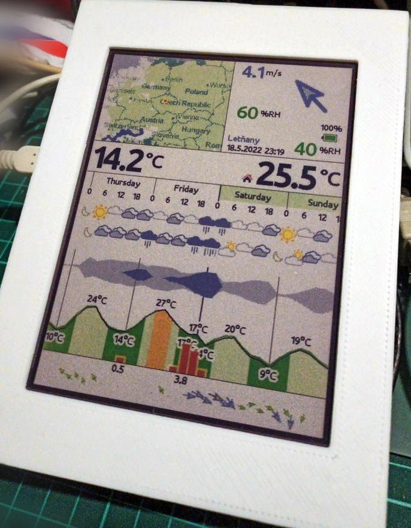

# Meteoink

## What Meteoink is

Meteoink is home meteostation based on [4.2 inch dual color E-Ink display](https://www.waveshare.com/4.2inch-e-paper-module-c.htm) (BWY variant)
or [5.65 inch 7 colors E-Ink display](https://www.waveshare.com/5.65inch-e-paper-module-f.htm) (ACEP variant),
[TTGO-T8-ESP32](https://github.com/LilyGO/TTGO-T8-ESP32) and [micropython 1.18](https://micropython.org/). Meteostation
is connected to your home WiFi and uses data from [OpenWeatherMap](https://openweathermap.org/) project for obtaining
weather forecast. It also uses [DHT22](https://github.com/semestrinis/Arduino/wiki/DHT22-temperature-humidity-sensor)
sensor for measuring indoor temperature and humidity. Whole system is powered from one
[18650 Li-On battery](https://en.wikipedia.org/wiki/List_of_battery_sizes#Lithium-ion_batteries_(rechargeable))
charged through the USB on ESP board. Meteostation is usually operating half a year when refresh time is set to
20 minutes and there is good internet WiFi access.

## Wiring

Some pins can be moved to another position by changing config file [pins.py](https://github.com/ondiiik/meteoink/tree/master/box).

but keep in mind that not all pins are available for any operation (some are not capable of ADC, some are not capable of SPI, ...).
Also battery is not displayed in wiring as it has its own connector so its connection is obvious.

## Box

Files for 3D printed parts are stored [here]().

Both variants of box are partialy screwed and partially glued as well as electronics. To stitch processor board or battery
you can use acrylate 3M double side tape. DHT22 sensor is glued to chassis (grid for air access sahll be on the side pointing
outside the box). When you glue it, apply glue very carefully as it shall not pass inside electronics
(especially in the case of buttons or DHT sensor). When all electronics is inside, then chassis shall be either glued to frame
(BWY variant) or screwed together (ACEP variant).

### BWY (EPD 4.2)

### ACEP (EPD 5.65)

## Micropython

To make software running on ESP32, you have to install Micropython first on it. You can install regular Micropython
according to [this tutorial](https://micropython.org/download/esp32spiram/), or simply use
[thonny IDE](https://randomnerdtutorials.com/getting-started-thonny-micropython-python-ide-esp32-esp8266/) to do
this job for you. Currently the metostation is tested with
[Micropython v. 1.18](https://micropython.org/resources/firmware/esp32spiram-20220117-v1.18.bin).

## Make littlefs

Once Micropython is installed, you can connect your ESP board to your computer by USB and attach to exposed UART
(baudrate shall be 115200 Bd). Once yo are connected over serial port, you can start using python console provided
through this port.

    >>> import sys
    >>> sys.implementation
    (name='micropython', version=(1, 18, 0))

As meteostation may time after time writes something on internal flash, then for flash healthy is better to use
`littlefs` instead of `FAT`. This can be done according to
[this tutorial](https://docs.micropython.org/en/latest/reference/filesystem.html#littlefs)

    import os
    os.umount('/')
    os.VfsLfs2.mkfs(bdev)
    os.mount(bdev, '/')

## Upload python code

The last step is to upload all python code into created file sytem. This code is located in repository folder
[esp32/micropython](https://github.com/ondiiik/meteoink/tree/master/esp32/micropython). There are precompiled python
files according to used variant of display. There is [esp32/micropython/bwy](https://github.com/ondiiik/meteoink/tree/master/esp32/micropython/bwy)
folder for 4.2 inch Black/White/Yellow display, or [esp32/micropython/acep](https://github.com/ondiiik/meteoink/tree/master/esp32/micropython/acep)
folder for 5.65 7-color ACEP display. Code is precompiled to speed up startup of software (shorter time when CPU consuming juice from battery),
and for better usage of RAM (compiler is not heavily involved). All files from selected folder shall be copied into board.
For this purpose REPL based file access engine such as [ampy](https://techtutorialsx.com/2017/06/04/esp32-esp8266-micropython-uploading-files-to-the-file-system/) or
[thonny IDE](https://randomnerdtutorials.com/getting-started-thonny-micropython-python-ide-esp32-esp8266/) can be used for writing files into file system.
Just keep in mind that you shall be disconnected from console otherwise this tools will not work properly.

## Configuration - first run

With first run the metostation automatically switch to WiFi AP mode. You can use QR codes displayed on screen to setup your mobile phone WiFi and open suitable WEB page.

Once you are connected to meteostation, you shall see webpage similar to this one:

To make station into operation you have to do following steps:

### Add your location

You shall add at least one location at the beginning. This location will be later used in WiFi configuration.
You can use more locations and bind them later to various WiFi, so when you are taking your weather station on holiday,
it choose location according to WiFi in your location.

### Add WiFi

Next step is to connect WiFi. When you attempt to connect WiFi, the list of available networks will be displayed.
Then you can choose one you want to use, assign suitable location and store it.

### Set OpenWeatherMap API key

The API key is long hash number which you shall
[get from OpenWeatherMap](https://home.openweathermap.org/users/sign_up). There are some personal API keys which are
for free however registration is required.

## Meteostation

Here we go ... once all above is passed, then simply press reset and wait till station is connected and forecast
displayed (it may take about one minute)

## Reconfiguration

If you want to get into setup WEB page again, then you have restart meteostation and immediately hold **config**
button, till beep (it may take even half minute). Then QR codes appears on screen and configuration web server will be ready after next beep.

## Others

### Translations

Currently supported languages are English and Czech, however any support for translation to another language is welcommed.
If someone wants to add the new language, it can be done in folder [lang](https://github.com/ondiiik/meteoink/tree/master/simulator/lang).
Translation is always a dictionary where the key is english sentense and the value is its translation.

If some additional characters needs to be added, this shall be done in file [font2png.py](https://github.com/ondiiik/meteoink/blob/master/graphics/font2png.py).
There is a line just like following containing supported characters:

`chars = 'aábcčdďeéěfghiíjklmnňoópqrřsštťuúůvwxyýzžAÁBCČDĎEÉĚFGHIÍJKLMNOÓPQRŘSŠTŤUÚŮVWXYÝZŽ0123456789'~!@#$%^&*()_+-[]{};\:"|,./<>?°' + "'"`

You can add your missing characters here. Please add only characters which are used by meteostation as this will became to be part of bitmaps loaded
into meteostation during startup. More characters means longer startup and shorter battery life per one charging cycle.
